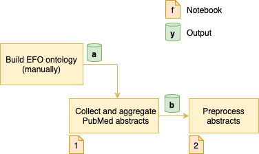

# Executive Functions Text Analysis

## Method Pipeline

> :warning: This is a rough draft figure. It's being updated.

### Notebooks

**Note**: Notebooks are stored in the [notebooks/](notebooks/) folder.

- **[1] [Data Collection.ipynb](notebooks/1%20Data%20Collection.ipynb)**: searches PubMed, aggregates abstracts as a single dataset, and stores the results in a single CSV file.

- **[2] [Preprocessing.ipynb](notebooks/1%20Data%20Collection.ipynb)**: performs tokenizing, stripping, stop words removal, word stemming, lemmatizing, and n-gram phrase detection (e.g., working_memory will be a single token instead of two words).

### Outputs

- **[a] [data/ontologies/efo.owl](data/ontologies/efo.owl)**: executive functions ontology (i.e. EFO), with the following IRI: `http://xcit.org/ontologies/2021/executive-functions-ontology`.
- **[b] [data/pubmed_abstracts.csv.gz](data/pubmed_abstracts.csv.gz)**: PubMed abstracts dataset of cognitive tasks and constructs; compressed in gzip format.
- **[c] [data/pubmed_abstracts_preprocessed.csv.gz](data/pubmed_abstracts.csv.gz)**: Preprocessed abstracts, compressed in gzip format. The format of the CSV file remains the same after preprocessing.
