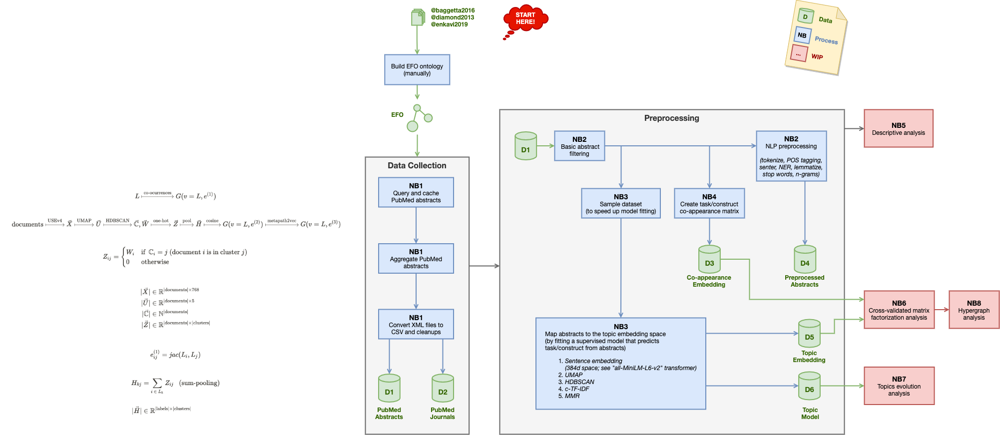

# Executive Functions Text Analysis

[TOC]

## Usage

The main entry points of interest are the notebooks in the `notebooks/` directory.

```bash
cd <project_root>/
ipython notebooks/<name>.ipynb
```

In addition to the notebooks, there are scripts for slow tasks that can be run on HPC or locally using Docker.


```bash
docker ...
```


## Method





## Notebooks

> **Note**: Notebooks are stored in the [notebooks/](notebooks/) folder.

- **<kbd>NB1</kbd> [Data Collection](notebooks/1%20Data%20Collection.ipynb)**: searches PubMed, aggregates abstracts as a single dataset, and stores the results in a single CSV file.

- **<kbd>NB2</kbd> [Preprocessing](notebooks/2%20Preprocessing.ipynb)**: performs tokenizing, stripping, stop words removal, word stemming, lemmatizing, and n-gram phrase detection (e.g., working_memory will be a single token instead of two words).

- **<kbd>NB3</kbd> [Preprocessing](notebooks/2%20Preprocessing.ipynb)**: TODO

- **<kbd>NB4</kbd> [Preprocessing](notebooks/2%20Preprocessing.ipynb)**: TODO

- **<kbd>NB5</kbd> [Preprocessing](notebooks/2%20Preprocessing.ipynb)**: TODO

## Data

- **<kbd>EFO</kbd> [data/ontologies/efo.owl](data/ontologies/efo.owl)**: executive functions ontology, i.e. EFO.
  
  The EFO ontology uses the following IRI to prefix its entities: `http://xcit.org/ontologies/2021/executive-functions-ontology`.

- **<kbd>D1</kbd> [data/pubmed_abstracts.csv.gz](data/pubmed_abstracts.csv.gz)**: PubMed abstracts dataset of cognitive tasks and constructs; compressed in gzip format.
- **<kbd>D2</kbd> [data/pubmed_journals.csv](data/pubmed_journals.csv)**: TBD

- **<kbd>D3</kbd> [data/pubmed_abstracts_preprocessed.csv.gz](data/pubmed_abstracts_preprocessed.csv.gz)**: TBD

- **<kbd>D4</kbd> [data/pubmed_cooc.csv](data/pubmed_cooc.csv)**: TBD

- **<kbd>D5</kbd> [...]()**: TBD

- **<kbd>D6</kbd> [...]()**: TBD
