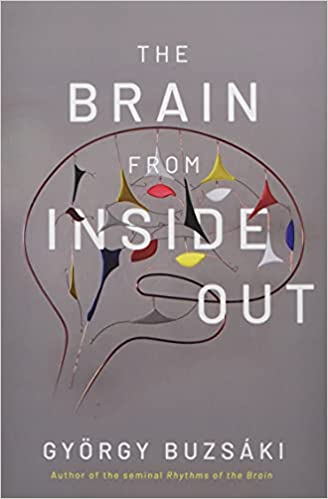

<!-- _class: lead -->

Clarifying Cognitive Constructs
by Automated Text Mining 
of the Literature
---

Morteza Ansarinia
Pedro Cardoso-Leite

 &nbsp;&nbsp;&nbsp;&nbsp;&nbsp; 

*COSA-LUCET Colloquium*
*July 14, 2021*

---
<!-- _class: lead -->

# :warning:

`
This is an ongoing study. Results are still inconclusive.
`

---
## Cognitive concepts are ambiguous

Cognitive scientists have created numerous constructs.

---

- Current state of affairs makes it hard to understand past results and limits scientific progress.

- Combining results from multiple disciplines is pretty difficult.

- It also makes it hard to develop effective interventions.

- There is a great need for more conceptual clarity.

---

<!-- _footer: Image from <mark>Buzsaki2019</mark>. -->

---

## Example: *Executive Functions*

Executive functions (<mark>Diamond2013</mark>), executive attention (<mark>Engle2002</mark>), executive control (<mark>Posner1990</mark>), attention control, attentional control (<mark>Bavelier2019</mark>), cognitive control (<mark>Botvinick2016</mark>), fluid intelligence (<mark>Diamond2013</mark>), fluid cognition, working memory (<mark>Baddeley1996</mark>), updating, shifting, and inhibition (<mark>Miyake2000</mark>).

# :exploding_head:

---

## Example: *Executive Functions*

**:question: To what extent those terms refer to different phenomena?**
**:question: To what extent those terms are synonymous or polysemous?**

--- 
## Executive Functions (EFs)

The ability to coordinate complex behaviors in pursuit of goals.

Focus of research in many disciplines, including psychology, neuroscience, and artificial intelligence.

<!-- _footer: Image reproduced from <mark>Botvinick</mark> at <mark>Triangulating Intelligence (Oct 2020)</mark>. -->
---

## Executive Functions (EFs)

:pizza: One example of such complex behaviors would be, for instance, cooking a pizza.

---

## Models of EFs

<!-- _footer: Images from <mark>Bavelier2019</mark> and <mark>Miyake2017</mark>. -->

---

<!-- _footer: Images from <mark>Dosenbach2007</mark> and <mark>Corbetta2008</mark>. -->
---

### To gain clarity, we can...

:feather: **Manually** read, synthesize, and criticize the literature to write reviews describing our understanding of the field.
- :thumbsdown: It's biased and reflect author's view.
- :chart_with_upwards_trend: Sheer volume of papers published every year
(200 EFs papers per month on PubMed).

*OR*

:robot: **Automatically** analyze of the scientific texts.

---
## Current project

<!--fit-->
This study aims a text-based method to gain clarity on the meaning of
- cognitive constructs (**conceptualize** EFs)
- the measures provided by cognitive tests (**operationalize** EFs)
- **brain** mechanisms of EFs

:bulb: Psychological constructs are not fully independent because the same tests may be used to characterize different constructs.

:bulb: Cognitive tests are similar to the extent that they measure similar set of constructs and activates similar brain mechanisms.

---

## Method

<!-- _class: gaia -->

- Develop a knowledge model of we know about EF-related constructs, tests, and brain mechanisms.
- Collect publications related to the constructs and tests.
- Parse the texts.
- Use computational methods to develop:
    1. descriptive statistics
    2. latent space model of tests/constructs co-appearance
    3. latent topic model

---
## Executive Functions Ontology

A machine-readable graph-based model of what we know about *Executive Functions*.

Main entities: cognitive test, cognitive construct, brain mechanism, cognitive model

---
### Executive Functions Ontology
### Building a knowledge model

- We then improved the ontology by manually adding tests, constructs, brain mechanism, models, and questionnaires from highly cited reviews$^1$.

    - `TODO` some statistics of the ontology

<!-- _footer:  $^1$ <mark>Diamond2013</mark>, <mark>Miyake2000</mark>, <mark>Baggetta2016</mark>, <mark>Enkavi2019</mark>, <mark>Eisenberg2019</mark>, <mark>CogPo</mark>, and <mark>CogAt</mark>. -->
---

---
## Data Collection
### Pipeline

`TODO: figure for data collection and preprocessing pipeline`

---
## Data Collection
### PubMed Abstracts

`TODO`

- Improving the ontology via manual knowledge mining of highly cited papers
- ...

---

<!-- _class: lead -->

## Results

---

**Frequency of tasks and constructs**

- Many tests and constructs but few are used (power law)

---

`TODO`

- number of tasks per paper (x), percentage of papers (y)
- how many papers used more than one task
- co-occurrence of tasks

message:
- ???

---

`TODO`

[same for the constructs]

---

`TODO`

evolution over time

- frequency given first appearance
- development of new tasks and constructs

---

**co-appearance of tests and constructs**

:thought_balloon: specificity of tests
- some are specific to a single construct
- some are generic as for many constructs

---

**co-appearance of tests and constructs**

:thought_balloon: Popular tests and constructs$^1$

<!-- _footer: This is a subset of previous heat map. -->

---
<!-- _class: lead -->

`TODO: topic modeling descriptive results`

--- 
# Latent Space

`TODO`

- Method 1: factorize the probability matrix of co-appearance
  - goal: ??? remind them that what is the goal. Answer should be the figure we are showing afterwards.
  - show the bavelier2019 as an example of what we want to do, but driven by data.
- [SKIP] Method 2: topic modeling

---

---
Cognitive tests
similarity map

---
Cognitive constructs
similarity map

---

<!-- _class: lead -->

`TODO: Topic evolution over time`

`leave aside for the presentation`

---
# Conclusion

- need for more rigorous methods to avoid confusion (e.g., ontology, constrained definition of constructs)
a theory about tasks
instead of focusing on confirmatory analysis, we can focus on tasks
a battery of tasks that covers most cognitive processes

---
## Limitations

- a measure of coherency that works for machines

limitations:
implicit decisions during data collection and processing
did not take into account that how often papers are cited
... (we are aware!)

---
## Future works
- questionnaires
- manually annotate part of the corpus
- a website for interactive visualizations
- ecologically valid tasks (models that do not involve standard lab-tasks)

---
## Reproducibility and open science

- EF ontology,
- collected PubMed corpus,
- notebooks, and codes

Currently are all the materials are available on *Uni HPC GitLab*. In the future it will be openly available on GitHub.

---
# References and Citations

<!-- class: gaia -->
`TODO`
