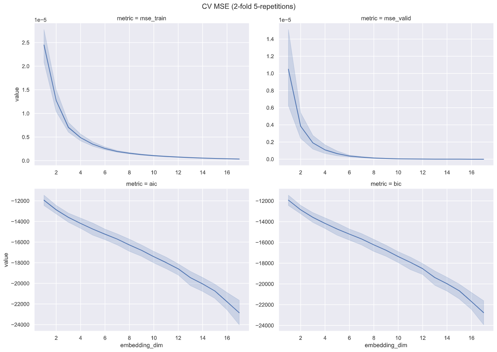

<!-- _class: lead -->

Clarifying Cognitive Constructs
by Automated Text Mining 
of the Literature
---

Morteza Ansarinia
Pedro Cardoso-Leite

*COSA-LUCET Colloquium*
*July 14, 2021*

 &nbsp;&nbsp;&nbsp;&nbsp;&nbsp; 

---
<!-- _class: lead -->

# :warning:

`
This is an ongoing study. Results are still inconclusive.
`

---

<!-- To understand our cognitive system,... -->
Cognitive scientists have created numerous concepts, referring to them by arbitrary names.

<!-- _footer: Images from <mark>Buzsaki2019</mark>. -->

---

:pensive: There is a many-to-many relationship between tests and constructs; e.g., constructs are not fully independent and the same tests are being loaded into different constructs.

:pensive: Current state of affairs makes it hard to understand past results and limits scientific progress.

:pensive: Combining results from multiple disciplines is pretty difficult.

:pensive: It also makes it hard to develop effective interventions.

:dart: There is a great need for more conceptual clarity.

---

## Example:
### *Executive Functions (EFs)*

<!--
To motivate the topic, I would like to give an example of such confusability in the literature.

**:question: To what extent those terms refer to different phenomena?**
**:question: To what extent those terms are synonymous or polysemous?**

-->

Executive functions (<mark>Diamond2013</mark>), executive attention (<mark>Engle2002</mark>), executive control (<mark>Posner1990</mark>), attention control, attentional control (<mark>Bavelier2019</mark>), cognitive control (<mark>Botvinick2016</mark>), self-regulation (<mark>Eisenberg2019</mark>), fluid intelligence (<mark>Diamond2013</mark>), fluid cognition, working memory (<mark>Baddeley1996</mark>), updating, shifting, and inhibition (<mark>Miyake2000</mark>).

# :exploding_head:

---

### To gain clarity, we can...

:feather: **manually** read, synthesize, and criticize the literature to write reviews describing our understanding of the field.
- :thumbsdown: It's biased and reflects author's view.
- :chart_with_upwards_trend: Sheer volume of papers published every year (200 EFs papers per month on PubMed).

*OR*

:robot: **automatically** analyze the scientific texts.

--- 
## Executive Functions (EFs)

The ability to coordinate complex behaviors in pursuit of goals.

Is a focus of research in many disciplines, including psychology, neuroscience, and artificial intelligence.

<!-- _footer: Image reproduced from <mark>Botvinick</mark> at <mark>Triangulating Intelligence (2020)</mark>. -->
---

## Executive Functions (EFs)

:pizza: One example of such complex behaviors would be, for instance, cooking a pizza.

---

## Models of EFs

<!-- _footer: Images from <mark>Bavelier2019</mark> and <mark>Miyake2017</mark>. -->

---

<!-- _footer: Images from <mark>Dosenbach2007</mark> and <mark>Corbetta2008</mark>. -->

---

## Current project

<!--fit-->

A text-based method to gain clarity on the meaning of EFs, including:

- how they should be **operationalized** (tests, batteries, instructions)
- how they should be **conceptualized** (constructs)
- how they should be **observed** (methods and brain mechanisms)

Ultimately, develop a shared latent space that connects many tests, constructs, and brain mechanisms.

---
## Method

---

## Method

<!-- _class: gaia -->

- Develop a knowledge model of what we know about EF-related constructs, tests, and brain mechanisms.
- Collect publications related to the constructs and tests.
- Parse the texts.
- Use computational methods to develop:
    1. descriptive statistics
    2. latent model of tests/constructs co-appearance
    3. latent topic model

---
### Executive Functions Ontology (EFO)

A machine-readable graph-based knowledge model of what we know about *Executive Functions*.

---
### Executive Functions Ontology (EFO)

- We created a seed ontology and then improved it by manually adding tests, constructs, brain mechanism, models, and questionnaires from highly cited review papers$^1$.

    - 102 EF tests.
    - 67 EF constructs.
    - *brain mechanisms, EF models, questionnaires, etc.*

<!-- _footer:  $^1$ <mark>Diamond2013</mark>, <mark>Miyake2000</mark>, <mark>Baggetta2016</mark>, <mark>Enkavi2019</mark>, <mark>Eisenberg2019</mark>, <mark>CogPo</mark>, and <mark>CogAt</mark>. -->
---

## EFO

---

<!-- _class: lead -->

## Preliminary Results

---

**Frequency of tasks and constructs**

- Many tests and constructs, but few are used (power law).

---

**PubMed-EF corpus: word cloud**

---

`SKIP`

- number of tasks per paper (x), percentage of papers (y)
- how many papers used more than one task
- co-occurrence of tasks

---

## Example Corpus: Stroop Task

---

## Example Corpus: Stroop Task

 

---

## New standard tests

 

---

**Co-appearance of tests and constructs**

:thought_balloon: specificity of tests
- some are specific to a single construct
- some are generic as for many constructs

---

**Co-appearance of tests and constructs**

:thought_balloon: Popular tests and constructs$^1$

<!-- _footer: This is a subset of previous heat map. -->

--- 
# A latent space of tasks and constructs

:thought_balloon: We are interested in a shared space of tests and constructs that encapsulates the similarity between one type given the other.

Similar to <mark>Peterson2019</mark> and <mark>Bavelier2019</mark>, but driven by data.

- Method 1: factorize the co-appearance matrix

$$
X_{m \times c} \approx M_{m \times n} \times C^T_{n \times c}
$$

- `SKIP` Method 2: topic modeling

<!-- _footer: $X$ is the co-appearances, $n$ is embedding dimension, $M$ is test, and $C$ is construct.
 -->

---

---

## Model fitting

- Non-negative factorization was used to infer latent matrices from a log-transformed probability matrix.
$$
\operatorname*{f}(n) = \alpha \times \min(\mathbf{MSE}_{1 \ldotp\ldotp \min(m,c)}) - \mathbf{MSE}_n(X-M \times C^T) \\
$$

$$
\operatorname*{argmin}_n(f(n)), f>0
$$

---
## Model fitting

---

---
Cognitive tests
similarity map

---
Cognitive constructs
similarity map

---
# Recap

- We created an ontology of EF-related cognitive tests and constructs,
- collected ~7GB of PubMed abstracts,
- developed tools to automatically analyze the texts,
- extracted a latent space that was shared between tests and constructs, and
- all to reduce the confusion.

---
# Conclusion

- EFs are redundant and unclear, yet analysis of the test/construct latent space reduces the confusion. 

- Need for more rigorous methods to avoid confusion (e.g., ontologies, constrained definition of constructs, data-driven knowledge models, and a theory about cognitive tests).

- Instead of focusing on confirmatory analysis, we can focus on cognitive tests (.e.g, use data to develop a battery that covers many cognitive constructs).

---
## Future works
- Improved topic modeling using transformers.
- Questionnaires in the ontology.
- Human-in-the-loop (manually annotate ambiguous parts of the corpus).
- A website for the interactive visualizations.
- Named Entity Tagging (NER) to identify new tests and constructs.

---
## Reproducibility and open science

<!-- class: gaia -->

Outcomes of this study include:

- EF ontology,
- collected PubMed corpus,
- trained NLP models and derived data,
- codes.

Currently are all the materials are available on **Uni HPC GitLab**.
In the future it will be openly available on GitHub.
